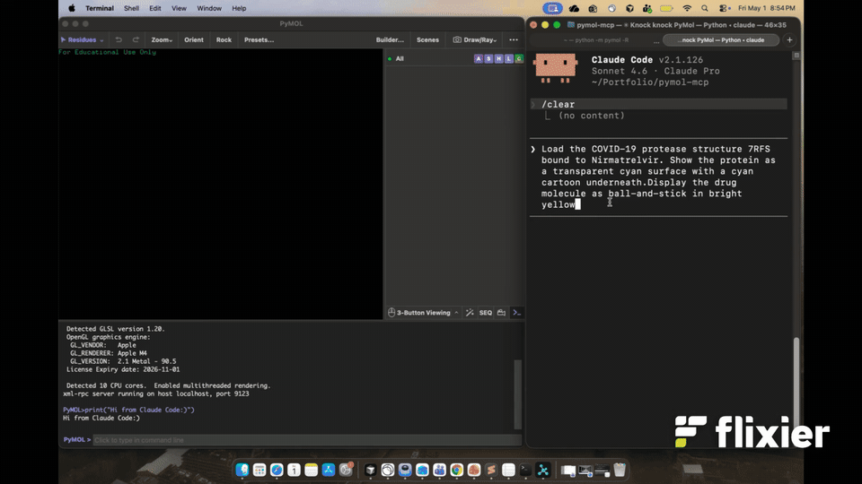
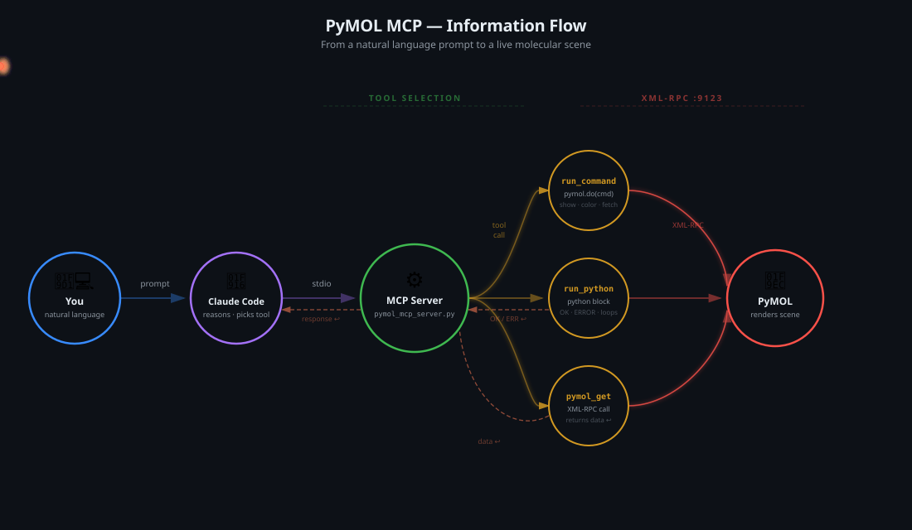

# Control PyMOL via Claud Code CLI

PyMOL MCP connects [Claude Code](https://claude.ai/code) to [PyMOL](https://pymol.org) via the Model Context Protocol, letting you control molecular visualizations. Describe what you want — fetch a structure, highlight active-site residues, color by secondary structure, measure distances — and Claude translates it into PyMOL commands in real time. It works locally on Mac or remotely on an HPC cluster through a simple SSH reverse tunnel, with no plugins or GUI interaction required.


<p align="center">
  
</p>

## How It Works

Claude picks from three MCP tools (`run_command`, `run_python`, `pymol_get`) to talk to PyMOL over XML-RPC.



## Prerequisites

- [PyMOL](https://pymol.org) 
- [Claude Code](https://claude.ai/code) (`npm install -g @anthropic-ai/claude-code`)
- Python 3.10+

## Launch PyMOl via terminal in PC

```
pymol -R
```

## Setup on Linux / HPC (Remote via SSH Tunnel)

Since PyMOL runs on your local Mac and Claude Code runs on the remote HPC, you need an SSH reverse tunnel to bridge them.

**1. Clone the repo on HPC**
```bash
git clone https://github.com/nagarh/pymol-claude-code
cd pymol-claude-code
```

**2. Install dependencies on HPC**
```bash
pip install mcp
```

**3. Choose a free port on HPC**
```bash
try <PORT>  = 49123 to check it is free or not 

ss -tlnp | grep <PORT> || echo "port is FREE" 
```

**4. Update the port in `pymol_mcp_server.py`**

Change this line to match your chosen port:
```python
pymol = xmlrpc.client.ServerProxy('http://localhost:<PORT>')
```

**5. Register the MCP server with Claude Code on HPC**
```bash
claude mcp add pymol python3 ./pymol_mcp_server.py

claude mcp list 

Verify this output 
pymol: python3 ./pymol_mcp_server.py - ✓ Connected
```

**6. On your PC — start the SSH reverse tunnel**

Skip this step if you are on a local Linux machine; it is only needed if you followed the above steps on an HPC system.
```bash
ssh -R <PORT>:localhost:9123 <user>@<hpc-address> 
```

**7. Open Claude Code**
```bash
claude
```

---

## Setup on Mac (Local)

**1. Clone the repo**
```bash
git clone https://github.com/nagarh/pymol-claude-code
cd pymol-claude-code
```

**2. Create virtual environment and install dependencies**
```bash
python3 -m venv venv
source venv/bin/activate
pip install mcp
```

**3. Register the MCP server with Claude Code**
```bash
claude mcp add pymol $(pwd)/venv/bin/python3 $(pwd)/pymol_mcp_server.py

claude mcp list

verify this output:
pymol_mcp_server.py - ✓ Connected
```

**4. Open Claude Code**
```bash
claude
```

PyMOL must be running with XML-RPC before using Claude Code.

---

## Usage

Once connected, Claude can control PyMOL directly. Example prompts:

- `fetch 1hho and show the protein as cartoon`
- `remove water molecules and show surface`
- `select residues within 4 angstroms of the ligand`
- `color the helices salmon and the ligand yellow`

## Auto-approve PyMOL MCP Permissions

By default Claude Code asks for approval every time a PyMOL tool is called. To disable this, add the following to your `~/.claude/settings.json`:

```json
{
  "permissions": {
    "allow": [
      "Bash(*)",
      "mcp__pymol__*"
    ]
  }
}
```
OR 

```bash
echo '{"permissions":{"allow":["Bash(*)","mcp__pymol__*"]}}' > ~/.claude/settings.json
```


This allows all PyMOL MCP tools (`run_command`, `run_python` and `pymol_get`) without prompting.

---

## Troubleshooting

**MCP server shows `failed`**
- Check that PyMOL is running with XML-RPC enabled
- Verify the port in `pymol_mcp_server.py` matches your tunnel port
- Restart Claude Code after changing the port

**Port is stuck on HPC**
- Always press `Ctrl+C` on the SSH tunnel before closing the terminal
- Use a different port if stuck: `ss -tlnp | grep <PORT> || echo "FREE"`
- Stuck ports are released by HPC's sshd automatically after some time
